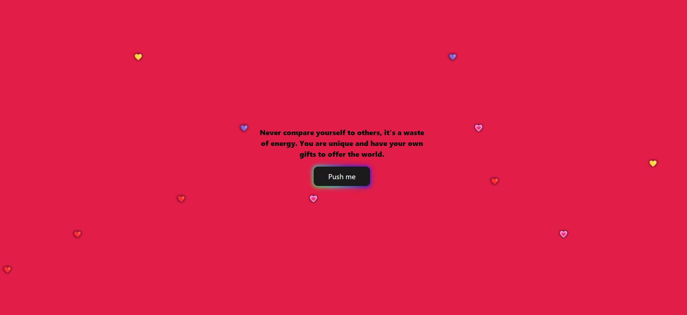

# Message4You

Message4You is a fun and interactive random message generating app created using Next.js. It generates random messages to bring joy and inspiration.

## Features

- Randomly generates uplifting and positive messages
- Fully customisable messages
- User-friendly interface
- Fully responsive design

## Installation

1. Clone the repository:

git clone https://github.com/7Jay-Lee7/Message4You.git

2. Change to the project directory:

cd Message4You

3. Install the dependencies:

npm install

## Usage

1. Run the app:

npm run dev

2. Open your web browser and navigate to http://localhost:3000.
3. Click the "Push me" button to generate a random message.
4. Enjoy the uplifting and positive messages!

### Customisation
You can customise the message categories by editing the messages.js file located in the Message directory. Add or remove messages as desired, following the provided format.

const message = [
	'I love hearing your ideas.',
	'You make a difference in my life.',
	'I love seeing the world through your eyes.',
	'Seeing you happy makes me happy.',
	'You mean the world to me.',
	'I hope you have an amazing day today.'
  ]
  
### Contributing
Contributions are welcome! If you have any ideas, suggestions, or bug reports, please open an issue or submit a pull request.

### License
This project is licensed under the MIT License.

Feel free to customise the README file further to include additional sections or information specific to your app.
